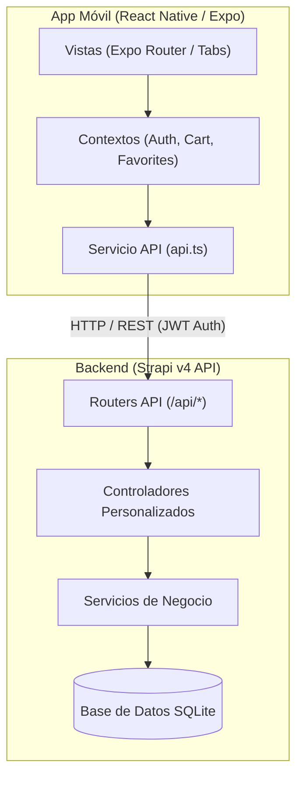
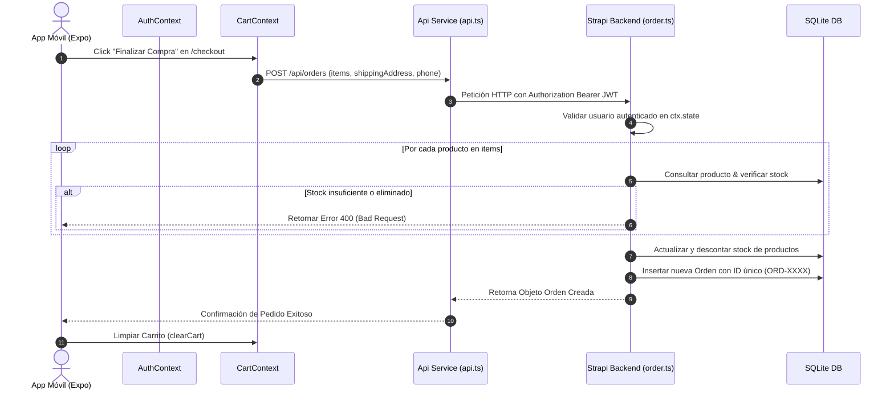

# Documentación Completa del Código y Arquitectura - Tienda Strapi

Este documento ofrece una explicación exhaustiva, técnica y estructurada de la arquitectura, componentes, flujos de datos y lógica del proyecto **tienda-strapi**.

---

## 1. Visión General de la Arquitectura

El proyecto es un sistema e-commerce Full Stack compuesto por dos módulos principales:
- **Backend**: API Headless basada en **Strapi v4** (Node.js, TypeScript y SQLite).
- **Mobile / Frontend**: Aplicación móvil multi-plataforma desarrollada en **React Native**, **Expo (SDK 57)** y **Expo Router**.



---

## 2. Documentación del Backend (`/backend`)

El backend gestiona el catálogo de productos, marcas, categorías, pedidos y autenticación de usuarios.

### 2.1 Estructura de Directorios

```text
backend/
├── config/                # Configuraciones de servidor, base de datos y middlewares
│   ├── database.ts        # Configuración de la base de datos SQLite
│   └── middlewares.ts     # Middlewares de seguridad, CORS y parseo de peticiones
├── src/
│   ├── index.ts           # Bootstrapping, permisos programáticos y Seeding inicial
│   └── api/               # Módulos de la API REST
│       ├── brand/         # Entidad Marca
│       ├── category/      # Entidad Categoría
│       ├── order/         # Entidad Pedido (con lógica de negocio de stock y compras)
│       └── product/       # Entidad Producto (con soporte para Soft Delete)
```

---

### 2.2 Modelos de Datos (Content-Types)

#### 1. Producto (`api::product.product`)
- **`name`** *(string, requerido)*: Nombre comercial del producto.
- **`slug`** *(string, requerido, único)*: Identificador único amigable para URLs.
- **`description`** *(text)*: Descripción detallada.
- **`price`** *(decimal, requerido)*: Precio base en USD.
- **`discount`** *(decimal, default: 0)*: Porcentaje de descuento (0 a 100).
- **`stock`** *(integer, default: 0)*: Cantidad de unidades disponibles.
- **`specs`** *(json)*: Especificaciones técnicas del producto en formato Key-Value.
- **`isDeleted`** *(boolean, default: false)*: Bandera para **Soft Delete**.
- **`category`** *(relation, manyToOne)*: Relación con la categoría correspondiente.
- **`brand`** *(relation, manyToOne)*: Relación con la marca correspondiente.

#### 2. Categoría (`api::category.category`)
- **`name`** *(string, requerido)*: Nombre de la categoría.
- **`slug`** *(string, requerido, único)*: Identificador en URL.
- **`description`** *(text)*: Descripción breve.
- **`products`** *(relation, oneToMany)*: Productos pertenecientes a la categoría.

#### 3. Marca (`api::brand.brand`)
- **`name`** *(string, requerido)*: Nombre de la marca.
- **`slug`** *(string, requerido, único)*: Identificador en URL.
- **`description`** *(text)*: Descripción.
- **`products`** *(relation, oneToMany)*: Productos asociados a la marca.

#### 4. Orden / Pedido (`api::order.order`)
- **`orderId`** *(string, requerido, único)*: Código alfanumérico único generado en backend (ej. `ORD-X8K9L2P`).
- **`user`** *(relation, manyToOne)*: Usuario comprador (`plugin::users-permissions.user`).
- **`items`** *(json, requerido)*: Array con la captura snapshot de los ítems comprados.
- **`total`** *(decimal, requerido)*: Monto total calculado del pedido.
- **`status`** *(enumeration: `pending`, `processing`, `completed`, `cancelled`)*: Estado del pedido.
- **`shippingAddress`** *(text, requerido)*: Dirección de entrega.
- **`paymentMethod`** *(string)*: Método de pago (ej. `simulated_card`).
- **`contactEmail`** / **`contactPhone`** *(string)*: Datos de contacto del cliente.

---

### 2.3 Lógica Personalizada de Negocio

#### Soft Delete de Productos (`src/api/product/controllers/product.ts`)
Para evitar borrar físicamente registros que puedan estar referenciados en ventas pasadas:
1. **`find`**: Sobrescribe la consulta predeterminada para filtrar e incluir únicamente productos donde `isDeleted: { $ne: true }`.
2. **`findOne`**: Verifica si el producto solicitado tiene `isDeleted === true`; en tal caso, retorna un `404 Not Found`.
3. **`delete`**: En lugar de eliminar la fila de la base de datos, actualiza `isDeleted: true`.

#### Gestión de Pedidos y Control de Stock (`src/api/order/controllers/order.ts`)
1. **`find`**: Asegura que el usuario autenticado solo pueda consultar **sus propios pedidos**. Aplica el filtro `user: user.id` mediante el servicio interno de Strapi después de realizar la sanitización de parámetros REST.
2. **`create`**:
   - **Validación de autenticación**: Requiere Token JWT activo.
   - **Validación de ítems**: Comprueba existencia del producto en BD, estado `isDeleted`, e invoca un control de stock estricto (`product.stock < quantity`).
   - **Cálculo seguro de totales**: Los precios y descuentos se leen directamente desde la base de datos en el backend, no desde el payload del frontend.
   - **Descuento de Stock**: Reduce la cantidad disponible (`stock`) de cada producto automáticamente.
   - **Generación de Orden**: Asigna un código alfanumérico único `orderId` y registra la orden con estado `processing`.

#### Inicialización Programática (`src/index.ts`)
En el método `bootstrap({ strapi })`:
1. Configura automáticamente los permisos para los roles `Public` y `Authenticated` de los endpoints de la API.
2. Comprueba si la base de datos está vacía. Si no hay categorías, crea automáticamente un set de datos de prueba (**Seeding**): Categorías (`Smartphones`, `Laptops`, `Accesorios`), Marcas (`Apple`, `Samsung`, `Asus`) y Productos reales con especificaciones técnicas.

---

## 3. Documentación del Frontend Móvil (`/mobile`)

Desarrollado en React Native y Expo utilizando **Expo Router** basado en el sistema de archivos (File-based routing).

### 3.1 Estructura de Directorios

```text
mobile/
├── app/                      # Rutas y Pantallas de la Aplicación
│   ├── _layout.tsx           # Layout raíz: Envuelve con AuthProvider, CartProvider, FavoritesProvider y ThemeProvider
│   ├── (auth)/               # Grupo de autenticación
│   │   ├── login.tsx         # Pantalla de Inicio de Sesión
│   │   └── register.tsx      # Pantalla de Registro de Usuario
│   ├── (tabs)/               # Navegación por pestañas (Tab Navigator)
│   │   ├── _layout.tsx       # Layout de la barra de navegación inferior
│   │   ├── index.tsx         # Inicio: Catálogo, Filtros y Búsqueda
│   │   ├── cart.tsx          # Carrito de Compras
│   │   ├── favorites.tsx     # Productos Favoritos
│   │   └── profile.tsx       # Perfil de Usuario e Historial de Pedidos
│   ├── checkout.tsx          # Pantalla de Finalizar Compra
│   └── product/[id].tsx      # Vista Detallada de Producto
├── components/               # Componentes Reutilizables de UI
│   ├── ProductCard.tsx       # Tarjeta de producto con botón de carrito y favorito
│   └── useColorScheme.ts     # Hook para soporte de Modo Oscuro / Claro
├── context/                  # Manejo de Estado Global
│   ├── AuthContext.tsx       # Autenticación, sesión JWT y almacenamiento local
│   ├── CartContext.tsx       # Estado del Carrito, cálculo de totales y persistencia
│   └── FavoritesContext.tsx  # Estado y gestión de lista de Favoritos
└── services/
    └── api.ts                # Cliente HTTP unificado con resolución dinámica de IP
```

---

### 3.2 Capa de Servicios y API (`services/api.ts`)

La capa de API implementa una resolución **dinámica de la IP del Host**:
- **Plataforma Web**: Se conecta a `http://localhost:1337`.
- **Dispositivos Móviles (Expo Go / Simuladores)**: Lee la IP local dinámica (`Constants.expoConfig?.hostUri`) emitida por el servidor Metro (ej. `http://192.168.0.208:1337`).
- **Persistencia de Sesión**: Inyecta automáticamente el encabezado `Authorization: Bearer <token>` recuperando el JWT desde `AsyncStorage`.

---

### 3.3 Contextos y Estado Global

#### 1. AuthContext (`context/AuthContext.tsx`)
- Administra el estado de la sesión del usuario (`user`, `token`, `isAuthenticated`, `isLoading`).
- Funciones expuestas:
  - `login(identifier, password)`: Autentica al usuario contra `/api/auth/local` y almacena el JWT en `AsyncStorage`.
  - `register(username, email, password)`: Registra un nuevo usuario en `/api/auth/local/register`.
  - `logout()`: Elimina el token y los datos de usuario guardados en el almacenamiento del dispositivo.
- Valida la validez del token en segundo plano al iniciar la app consultando `/api/users/me`.

#### 2. CartContext (`context/CartContext.tsx`)
- Administra el carrito de compras (`cartItems`, `addToCart`, `removeFromCart`, `updateQuantity`, `clearCart`).
- Mantiene los ítems sincronizados localmente mediante `AsyncStorage` para no perder la selección al cerrar la app.
- Calcula en tiempo real la cantidad total de artículos y el importe subtotal acumulado.

#### 3. FavoritesContext (`context/FavoritesContext.tsx`)
- Maneja la lista de productos marcados como favoritos (`favorites`, `toggleFavorite`, `isFavorite`).
- Guarda la preferencia del usuario en `AsyncStorage`.

---

### 3.4 Pantallas y Flujos de Usuario

1. **Pantalla Principal (`app/(tabs)/index.tsx`)**:
   - Muestra el listado de productos consumido desde `/api/products?populate=*`.
   - Permite búsqueda en tiempo real por texto (nombre/marca).
   - Filtros dinámicos por Categoría y Marca.
   - Estado de carga (`ActivityIndicator`) y manejo de errores.

2. **Detalle del Producto (`app/product/[id].tsx`)**:
   - Muestra las especificaciones técnicas completas (`specs`), precio, descuento aplicable, stock disponible e imagen en alta resolución.
   - Permite seleccionar la cantidad a agregar al carrito o alternar el estado de favorito.

3. **Carrito de Compras (`app/(tabs)/cart.tsx`)**:
   - Visualización de la lista de ítems agregados, ajuste de cantidades (+ / -) y eliminación de productos.
   - Desglose financiero: Subtotal, Descuento total aplicado y Total a pagar.
   - Botón directo hacia el proceso de **Checkout**.

4. **Checkout (`app/checkout.tsx`)**:
   - Formulario de dirección de envío y teléfono de contacto.
   - Verificación de sesión de usuario (redirecciona a inicio de sesión si no está autenticado).
   - Envío del pedido al backend (`POST /api/orders`).
   - Al completarse la compra, limpia el carrito y muestra una pantalla de confirmación exitosa con el ID de la orden generada.

5. **Perfil de Usuario (`app/(tabs)/profile.tsx`)**:
   - Presenta la información del usuario en sesión (`username`, `email`).
   - Historial de pedidos realizados consumido desde `/api/orders?sort=createdAt:desc`.
   - Cierre de sesión seguro.

---

## 4. Diagrama de Secuencia: Flujo de Compra



---

## 5. Guía de Ejecución y Despliegue

### Requisitos Previos
- **Node.js**: Versión `>= 18.0.0`
- **npm**: Versión `>= 6.0.0`

### Instrucciones paso a paso

#### 1. Iniciar Backend
```bash
cd backend
npm install   # Solo la primera vez
npm run develop
```
- Admin panel: `http://localhost:1337/admin`
- REST API Base: `http://localhost:1337/api`

#### 2. Iniciar Aplicación Móvil
```bash
cd mobile
npm install   # Solo la primera vez
npm start
```
- Presiona `w` para la versión Web.
- Escanea el código QR con **Expo Go** en iOS / Android.
